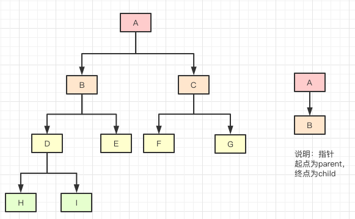

[Oracle Java 泛型官方教程-英文版
](https://docs.oracle.com/javase/tutorial/java/generics/index.html)

[Oracle Java 泛型官方教程-中文版](https://pingfangx.github.io/java-tutorials/java/generics/index.html)
# 一，打破砂锅问到底
 

### Q：什么是泛型？泛型的来源？
### A：
- Java泛型(Generics)是 JDK5 中引入的一种参数化类型特性。
- 在 JDK5 之前没有泛型的只有 class，所有的类都是class，也就是原始类型(raw type)(原始类型不仅仅包含我们平常所指的类，还包括枚举、数组、注解等,还有基本类型即int,float,double等)。Java还统一定义了一个class类对原始类型进行抽象，class类的一个具体对象就是一个类。
 - 然后有了泛型，超出了原始类型的定义，为了统一与泛型有关的类型和原始类型Class，引入了Type接口，Type接口的实现类除了Class原始类型又增加了4个和原始类型平级的类型，他们是:
    1. 泛型数组类型(GenericArrayType): 表示一种元素类型是参数化类型或者类型变量的数组类型，如 GenericClass<T>[]；
    1. 参数化类型(ParameterizedType): 就是用了泛型的类，如 List<String>、Map<String,Integer>；
    1. 泛型变量(TypeVariable): 是各种类型变量的公共高级接口，如 <T>
    1. 泛型通配符类型(WildcardType): 通配符类型, 如 <?>, <? extends T> ；

 但是jvm只可以处理class原始类型，这个是java一开始就定义好的，如果要改的话，就需要在jvm中增加4种字节码文件，对于jvm改动太大，
 所以Oracle就只在javac编译阶段做兼容。这个也就是为什么我们说java的泛型是伪泛型，因为jvm并不支持泛型。
 

### Q：最常用的类型形参名称有哪些？
### A：
 * E：元素（Element），多用于java集合框架
 * K：键（Key）
 * V：值（Value）
 * N：数字（Number）
 * T：类型（Type）
 * S：第二类型
 * U：第三类型

### Q：为什么使用泛型，使用泛型的好处？
### A：
- 代码更健壮(类型安全，编译器会检查类型，只要编译期没有警告，那么运行期就不会出现 ClassCastException)
- 代码更简洁(不需要强制类型转换)
- 代码更灵活，代码复用（适用于多种数据类型执行相同的代码）
 
测试代码：

```

```

### Q：泛型类/泛型接口/泛型方法如何定义与使用？
### A：

泛型类：
```
//定义一个泛型类
public class GenericClass<T>{}
// 实例化一个泛型类
GenericClass<String> genericClass = new GenericClass<String>();
```
泛型接口：

```
//定义一个泛型接口
public interface GenericInterface<T> {}
//实现泛型接口方式一
public class ImplGenericInterface1<T> implements GenericInterface<T>
//实现泛型接口方式二
public class ImplGenericInterface2 implements GenericInterface<String> {}
```
泛型方法：
```
//定义一个泛型方法
//只有在返回值类型之前添加"<T>"才叫泛型方法
private static <T> T genericAdd(T a, T b) {} 
//调用一个泛型方法
genericClass.<Int>genericAdd(1,2);
```
###  Q：Java泛型机制存在哪些缺陷？
###  A：

### Q：Java泛型的原理？什么是泛型擦除机制？
### A：
Java的泛型是 JDK5 新引入的特性，为了不对 jvm 做很大的改动，java需要在编译阶段做向下兼容，所以在编译泛型代码时，JDK会把我们写的泛型转化为 jvm 所支持的原始类型，也就是class类型，并且保持语法不变，也就是说Java在编译期擦除了所有的泛型信息。

### Q：Java编译器具体是如何擦除泛型的？
### A： 
- 检查泛型类型，获取目标类型
- 擦除类型变量，并替换为限定类型
    - 如果泛型类型的类型变量没有限定(即只有<T>),则用Object作为原始类型
    - 如果有限定(<T extends XClass>),则用XClass作为原始类型
    - 如果有多个限定(T extends XClass1&XClass2),则使用第一个边界XClass1作为原始类型
- 在必要时插入类型转换以保持类型安全
- 生成桥方法以在扩展时保持多态性


### Q：泛型不是被擦除了吗？ 那为何反射还能获取泛型类型？
### A：
- Java 的泛型机制虽然在编译期间进行了擦除，但是在编译 Java 源代码成 class 文件中还是保存了泛型相关的信息。
- 这些信息被保存在 class 字节码的常量池中，使用了泛型的代码处会生成一个 signature 签名字段，通过 signature 签名字段指明了这个常量池的地址。
- JDK 提供了 api 去读取这些泛型信息的方法，
然后再借助反射就可以获得泛型参数的具体类型。

### Q：Retrofit中是如何利用泛型进行Json解析的？
### A：

### Q：Gson 是如何解析数据到泛型类型Bean结构的呢？
### A：

### Q: 说一下泛型中的继承关系？
### A: 
Generic<A> 与 Generic<B> ,
Generic<A> 与 ChildGeneric<A>

### Q: 说一下泛型通配符？
### A: 
通配符让转型更灵活
- 上届通配符 <？extends T>;
- 下届通配符<？super T>;
- 非限定通配符<?> == <? extends Object>

### Q: 说一下Java泛型中的PECS原则？
### A: 
PECS即 Producer extends Consumer super
- 如果你只需要从集合中获得类型T , 使用<? extends T>通配符
- 如果你只需要将类型T放到集合中, 使用<? super T>通配符
- 如果既不能存也不能取使用<?> 通配符
- 如果你既要获取又要放置元素，则不使用任何通配符。例如List<String>

### Q: 为什么范型中的<？extends X> 通配符主要用于安全地读数据？
### A:

### Q: 为什么范型中的 <？super X>  通配符主要用于安全地写入数据？
### A:

### Q: 为什么范型中的 <?> 通配符既不能存也不能取？
### A:

<？extends X>  表示类型的上界，类型参数 T 是 X 的子类，那么可以肯定的说，
get方法返回的一定是个 X（不管是X或者X的子类）编译器是可以确定知道的。
但是set方法只知道传入的是个 X，至于具体是 X 的那个子类，不知道。
总结：<？extends X> 限定符主要用于安全地读数据，可以访问 X 及其子类型，并且不能写入非null的数据。

 //<? extends Father> set方法不能写入
 // setData(T setData) 方法执行 this.data = setData;
 // 该语句是将 setData 的值赋值给 data (setData 和 data 泛型类型为 <? extends Father>) 表示限定 T 为 Father 的子类（包括 Father ）
 // 又因为子类可以安全的转型为父类，如果能找到一个Father类的最下届的子类就可以赋值，
 // 但是在Java中只有最上届的类型Object 不存在最下届的类型，所以没有这样的类型可以赋值给 data
 //extendFatherGenericClass.setData(father); //无法执行
 //extendFatherGenericClass.setData(son); //无法执行

  //<? extends Father> get方法只能读取出 Father 类型或 Father 的父类型
  // T getData() 方法执行 return data; 该语句是返回 data(data 泛型类型为 <? extends Father>) 表示限定 T 为 Father 的子类（包括 Father ）
  // 那什么样的类型可以存放取出来的这个 data 呢？只知道是 Father 的子类就行，但是不能确定是哪个子类，
  // 又因为子类可以安全的转型为父类, 所以作为 Father 所有子类中的父类 Father 以及 Father 的父类型肯定可以接收这个 data
  Father fatherData = extendFatherGenericClass.getData();
  Object fatherDat = extendFatherGenericClass.getData();


<？super X> 表示类型的下界，类型参数是 X 的父类（包括 X 本身），
public T getData() {return data;}
get() 方法返回的一定是个 X 的超类，那么到底是哪个超类？不知道，但是可以肯定的说，Object一定是它的Son超类，所以get方法返回Object。编译器是可以确定知道的。
public void setData(T data) { this.data = data; }
对于set()方法来说，编译器不知道它需要的确切类型，但是 X 和 X 的子类可以安全的转型为 X。
总结：<？super X> 限定符主要用于安全地写入数据，可以写入 X 及其子类型。

 // <? super Son> set方法只能写入Son本身和它的子类

 // setData(T setData) 方法是执行 this.data = setData;
 // 该语句是将 setData 的值赋值给 data (setData 和 data 泛型类型为 <? super Son>) 表示限定 T 为Son的父类（包括Son）
 // 又因为子类可以安全的转型为父类，所以作为最下届的子类型 Son(Son的子类也可以安全的转为Son类型)的数据类型肯定可以赋值给 data
 // supperSonGenericClass.setData(new Object()); //无法执行
 // supperSonGenericClass.setData(new Father()); //无法执行

 // <? super Son> get方法只能读取出 Object 类型
 // T getData() 方法执行 return data; 该语句是返回 data(data 泛型类型为 <? super Son>) 表示限定 T 为Son的父类（包括Son）
 // 那什么样的类型可以存放取出来的这个 data 呢？只知道是 Son 的父类就行，但是不能确定是哪个父类，
 // 又因为子类可以安全的转型为父类,所以作为最上届的父类型 Object 肯定可以接收这个data
 Object data = supperSonGenericClass.getData();
 //Son sonData = supperSonGenericClass.getData(); //无法执行

  <?> 指定了没有限定的通配符
  //<?> set方法不能写入人类类型

  // 因为子类可以安全的转型为父类，如果能找到一个任意一个的最下届的子类就可以赋值，
  // 但是在Java中只有最上届的类型 Object 不存在最下届的类型，所以没有这样的类型可以赋值给 data
  //genericClassCommon.setData(genericClass);
  //genericClassCommon.setData(new Object());

 // <?> get方法只能读取出 Object 类型

  //因为子类可以安全的转型为父类,所以不管什么类型，作为最上届的父类型 Object 肯定可以接收这个data
  Object object = genericClass.getData();


 
测试代码：

```

```
